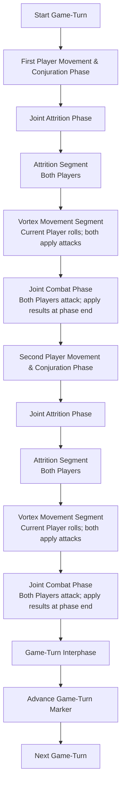

# Sorcerer Documentation

```mermaid
flowchart TD

A[Start Game-Turn] --> B[First Player Movement & Conjuration Phase]

B --> C[Joint Attrition Phase]

C --> C1[Attrition Segment<br/>Both Players]
C1 --> C2[Vortex Movement Segment<br/>Current Player rolls; both apply attacks]

C2 --> D[Joint Combat Phase<br/>Both Players attack; apply results at phase end]

D --> E[Second Player Movement & Conjuration Phase]

E --> F[Joint Attrition Phase]

F --> F1[Attrition Segment<br/>Both Players]
F1 --> F2[Vortex Movement Segment<br/>Current Player rolls; both apply attacks]

F2 --> G[Joint Combat Phase<br/>Both Players attack; apply results at phase end]

G --> H[Game-Turn Interphase]
H --> H1[Advance Game-Turn Marker]
H1 --> I[Next Game-Turn]
```
